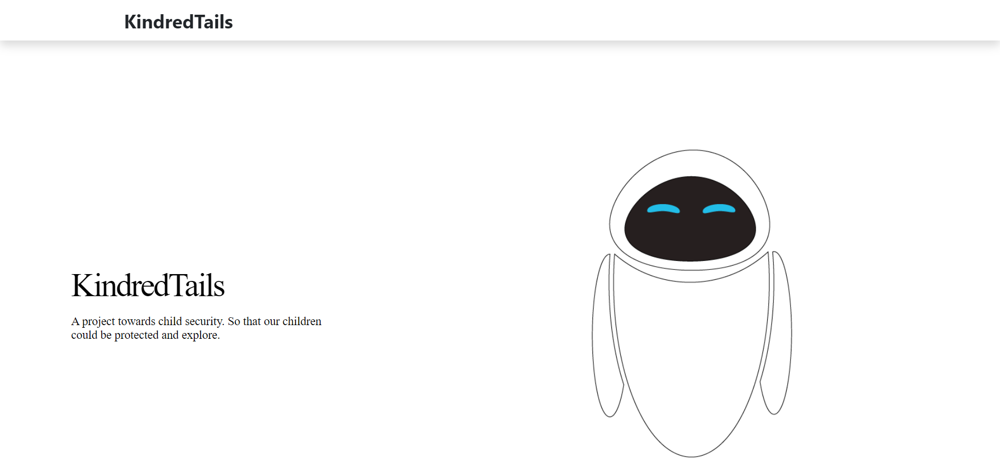
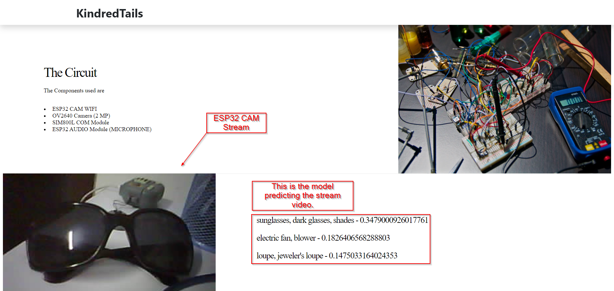

# Kindred Tails
Video streaming and object detection via tenserflow and using ESP32 Cam AI Thinker as the Hardware.

## Check out web folder for webapp screenshots.
## Some ScreenShots
## Home

The logo is of eve from the movie: Wall-E.

## ESP32 LiveStream
This Shows the circuit and the live video stream from ESP32 CAM AI thinker and the model predicting the object and sending the values of accuracy.

