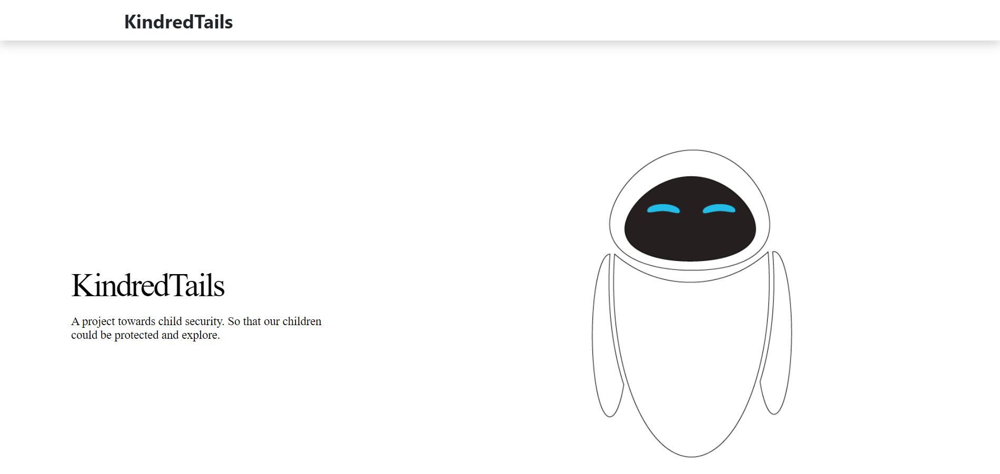
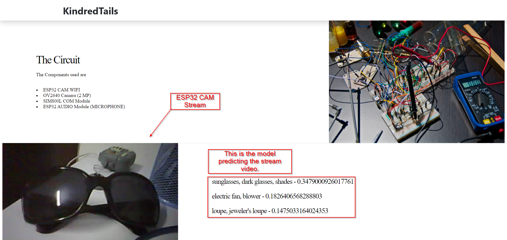
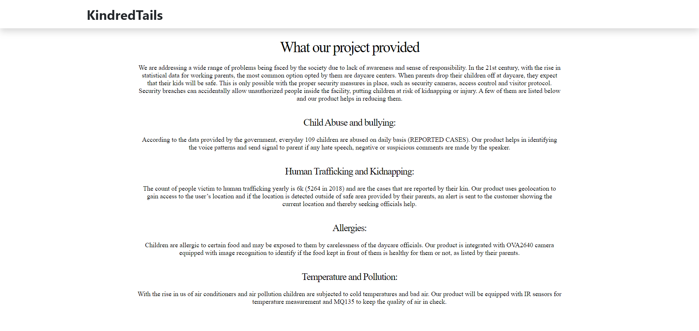

# KindredWeb

## Development server

Run `ng serve` for a dev server. Navigate to `http://localhost:4200/`. The app will automatically reload if you change any of the source files.
## Build

Run `ng build` to build the project. The build artifacts will be stored in the `dist/` directory. Use the `--prod` flag for a production build.

## ScreenShots
## Home

The logo is of eve from the movie: Wall-E.
## Some Description

## ESP32 LiveStream
This Shows the circuit and the live video stream from ESP32 CAM AI thinker and the model predicting the object and sending the values of accuracy.

## Conclusion
The possibility of what could happen if this project was a success.

